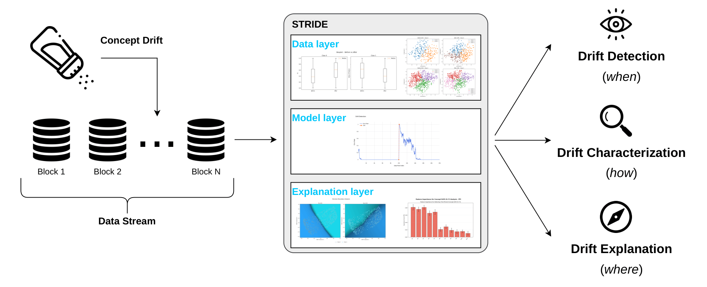

# STRIDE: STReam Insight and Drift Explanation

A Python Toolkit for Concept Drift Detection, Characterization, and Explanation

[](https://michalredm.github.io/stride-website/assets/pdf/paper.pdf)
[](https://michalredm.github.io/stride-website/)
[](https://stream-insight-and-drift-explanation.streamlit.app/)
[](https://github.com/KubaCzech/STRIDE/actions/workflows/ci.yml)

[](https://github.com/astral-sh/ruff)
[](LICENSE)

[Website](https://michalredm.github.io/stride-website/) &bull; [Live Dashboard](https://stream-insight-and-drift-explanation.streamlit.app/) &bull; [Paper (PDF)](https://michalredm.github.io/stride-website/assets/pdf/paper.pdf) &bull; [Architecture](#three-layer-architecture) &bull; [Quickstart](#quickstart) &bull; [Citation](#citation)

---

## Overview

Concept drift in streaming environments degrades machine learning models when underlying data distributions evolve over time. Traditional drift detectors (e.g., DDM, EDDM, ADWIN) signal **when** classifier accuracy drops, but treat the model and data as black boxes—failing to explain **how** the distribution shifted or **where** in the feature space decision boundaries deteriorated.

**STRIDE** (*STReam Insight and Drift Explanation*) bridges this diagnostic gap. Presented at **ECML PKDD 2026** (Demo Track), STRIDE is an open-source Python framework and interactive dashboard that orchestrates analytical signals across three concurrent layers:

1. **Data Layer** (*How*): Monitors raw input distributions and cluster geometry independently of the model.
2. **Model Layer** (*When*): Tracks predictive performance metrics and fires sequential drift alerts.
3. **Explanation Layer** (*Where*): Adapts Explainable AI (xAI) methods to locate local decision boundary shifts, identify drift-driving features, and detect recurring concepts.

Instead of triggering post-hoc explanations only after significant performance degradation, STRIDE executes a **synchronous pipeline** that processes incoming windows across all three layers in parallel. This design enables analysts to trace the emergence of drift and observe the evolution of model logic in real time.

---

## Three-Layer Architecture



### 1. Data Layer (Statistical & Geometric Shifts)
Evaluates covariate shifts independent of the predictive model:
* **Descriptive Statistics & Divergences**: Computes class-conditional moments, variances, and 1D Wasserstein distances to evaluate distribution movement.
* **Non-Parametric Hypothesis Tests**: Two-sample Kolmogorov-Smirnov (KS) and Anderson-Darling tests detect significant univariate distribution differences between sliding windows.
* **Clustering Dynamics**: Evaluates density shifts using X-means clustering, applying the Hungarian algorithm to track cluster splitting, migration, and centroid displacement across consecutive batches.

### 2. Model Layer (Performance Triggers)
Tracks streaming model health and online error rates:
* **Streaming Detectors**: Integrates the [River](https://riverml.xyz/) stream learning ecosystem, supporting Drift Detection Method (DDM) and related sequential algorithms.
* **Continuous Error Profiling**: Real-time evaluation of error rate trajectories, warning bands, and predictive confidence across sliding windows.

### 3. Explanation Layer (Model-Agnostic Interpretability)
Explains the mechanics of detected drift within the classifier's feature space:
* **Supervised Decision Boundary Maps (SDBM)**: Projects high-dimensional feature spaces into 2D to visualize how class separation boundaries rotate, compress, or deform between pre-drift and post-drift states.
* **Feature Importance Attribution**: Evaluates both model-centric (SHAP, Permutation Feature Importance) and data-centric importance shifts to differentiate features driving model degradation from those preserving predictive utility.
* **Recurring Concept Analysis**: Extracts prototype representations per window and applies HDBSCAN clustering to distance matrices, distinguishing re-emerging historical concepts from novel anomalies.

---

## Interactive Dashboard

STRIDE includes a reactive [Streamlit](https://streamlit.io/) dashboard designed for interactive forensics and exploratory research.

* **Replay Streams**: Step through continuous streams or jump directly to detected drift points.
* **Comparative Window Analysis**: Compare pre-drift reference windows with post-drift detection windows across all three analytical layers side by side.
* **Dynamic Configuration**: Adjust sliding window sizes, statistical test significance thresholds ($\alpha$), and classifier architectures on the fly.
* **Hosted Demo**: An interactive demo is deployed at [stream-insight-and-drift-explanation.streamlit.app](https://stream-insight-and-drift-explanation.streamlit.app/).

---

## Quickstart

### Running the Interactive Dashboard

Launch the dashboard locally:

```bash
streamlit run dashboard/app.py
```

The application opens at `http://localhost:8501`.

### Python API Usage

STRIDE can be integrated programmatically into experimental scripts and streaming pipelines:

```python
import sys
sys.path.append("src")

from datasets.hyperplane_drift import HyperplaneDriftDataset
from descriptive_statistics.statistical_tests import (
    StatisticalTestsDriftDetector,
    StatisticalTestType,
)

# 1. Generate a synthetic streaming dataset with rotating hyperplane drift
dataset = HyperplaneDriftDataset()
X, y = dataset.generate(
    n_samples_before=1000,
    n_samples_after=1000,
    n_features=5,
    n_drift_features=2,
    drift_width=100,
    random_seed=42,
)

# 2. Partition into reference (pre-drift) and detection (post-drift) windows
X_ref, y_ref = X.iloc[:1000], y.iloc[:1000]
X_det, y_det = X.iloc[1000:], y.iloc[1000:]

# 3. Detect and characterize distribution shifts via non-parametric statistical tests
detector = StatisticalTestsDriftDetector(X_ref, y_ref, X_det, y_det)
has_drift = detector.detect(StatisticalTestType.KolmogorovSmirnov)

print(f"Drift detected: {has_drift}")
print(f"Per-feature test outcomes: {detector.drift_flags}")
```

---

## Installation

### Prerequisites

* Python 3.10, 3.11, or 3.12
* Git

### Setup

1. **Clone the repository**:
   ```bash
   git clone https://github.com/KubaCzech/STRIDE.git
   cd STRIDE
   ```

2. **Create and activate a virtual environment**:
   ```bash
   # Linux / macOS
   python3 -m venv .venv
   source .venv/bin/activate

   # Windows (PowerShell)
   python -m venv .venv
   .venv\Scripts\Activate.ps1
   ```

3. **Install dependencies**:
   ```bash
   pip install --upgrade pip
   pip install -r requirements.txt
   ```

4. **Verify the installation**:
   ```bash
   python -m unittest discover tests
   ```

---

## Supported Drift Scenarios & Models

### Synthetic Drift Generators
* **Hyperplane Drift**: Continuously rotating hyperplane in $d$-dimensional space simulating gradual concept drift.
* **SEA Drift**: Abrupt decision threshold displacement with noise features.
* **RBF Drift**: Non-linear cluster movement and centroid translation in continuous feature space.
* **Linear Weight Inversion (LWI)**: Correlation inversion testing model sensitivity to feature attribution flips.
* **Multi-Window Generators**: Mixed, Sine, STAGGER, and Random Tree streams for multi-concept scenarios.
* **Real-World Benchmarks**: Pre-configured support for benchmark datasets (e.g., Electricity, Covertype, NOAA weather).

### Model Implementations
* Multi-Layer Perceptrons (MLP / Neural Networks)
* Random Forests
* Support Vector Machines (SVM)
* Logistic Regression & incremental online models via River

---

## Project Structure

```text
STRIDE/
├── assets/                    # Architecture diagrams and visual documentation
│   └── pipeline.png
├── dashboard/                 # Streamlit interactive application
│   ├── app.py                 # Application entry point
│   ├── assets/                # Dashboard styles and custom CSS
│   └── components/            # UI tabs (Data, Model, Explanation layers)
├── src/                       # Core toolkit algorithms
│   ├── datasets/              # Streaming data generators and real datasets
│   ├── DDM/                   # River drift detectors and error descriptors
│   ├── decision_boundary/     # Supervised Decision Boundary Maps (SDBM)
│   ├── descriptive_statistics/# Statistical tests (KS, AD, Wasserstein)
│   ├── feature_importance/    # SHAP and Permutation Feature Importance
│   ├── models/                # Model wrappers (MLP, Random Forest, SVM)
│   └── recurrence/            # Prototype extraction & HDBSCAN concept clustering
├── tests/                     # Automated test suite
├── pyproject.toml             # Package configuration and ruff lint settings
└── requirements.txt           # Core runtime dependencies
```

---

## Citation

If you use STRIDE in your research, please cite our paper from the **ECML PKDD 2026 Demo Track**:

```bibtex
@inproceedings{aksoy2026stride,
  title     = {{STReam Insight and Drift Explanation (STRIDE): a Python Toolkit for Concept Drift Detection and Explanation}},
  author    = {Aksoy, Deniz and Czech, Kuba and Nag{\'o}rka, Wojciech and Redmer, Micha{\l} and Stefanowski, Jerzy},
  booktitle = {European Conference on Machine Learning and Principles and Practice of Knowledge Discovery in Databases (ECML PKDD)},
  year      = {2026}
}
```

---

## Authors & Acknowledgments

* **Deniz Aksoy** &bull; Poznań University of Technology
* **Kuba Czech** &bull; Poznań University of Technology
* **Wojciech Nagórka** &bull; Poznań University of Technology
* **Michał Redmer** &bull; Poznań University of Technology
* **Jerzy Stefanowski** &bull; Poznań University of Technology

**Funding**: The research by Jerzy Stefanowski was funded by the National Science Centre, Poland, under OPUS grant no. `2023/51/B/ST6/00545`.

Project Website: [https://michalredm.github.io/stride-website/](https://michalredm.github.io/stride-website/)

---

## License

This project is licensed under the MIT License. See the [LICENSE](LICENSE) file for details.
