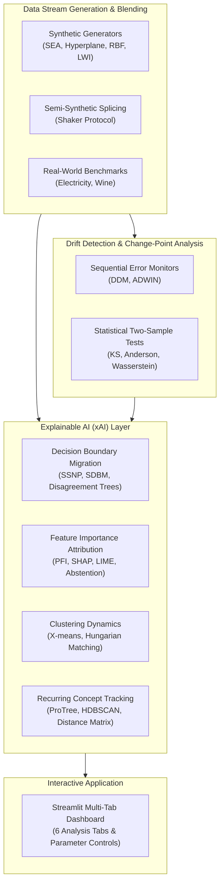

# STRIDE: Explainable AI & Drift Detection Framework

  <h3>Publication-grade Research Framework for Detecting, Characterizing, and Explaining Concept Drift</h3>

---

## 🌟 Overview

**STRIDE** (*STReam Insight and Drift Explanation*) is a modular Python research framework and interactive Streamlit application designed for detecting, localizing, and interpreting concept and data drift in machine learning data streams.

While standard drift detection algorithms output binary alarms signaling that distribution changes occurred, STRIDE leverages modern **Explainable AI (xAI)** techniques to answer *how*, *where*, and *why* the data stream drifted:

1. **Statistical Data Layer**: Non-parametric two-sample hypothesis tests (Kolmogorov-Smirnov, Anderson-Darling) and Earth Mover's distance (1D Wasserstein $\mathcal{W}_1$) measuring covariate shift $P(X)$.
2. **Sequential Model Layer**: Performance-based sequential error stream monitoring (DDM, ADWIN) identifying change points and drift boundaries.
3. **Decision Boundary Migration**: Self-Supervised Neighbor Projections (SSNP) and Disagreement Decision Trees mapping spatial migrations of classifier decision frontiers.
4. **Feature Attribution Shift**: Permutation Feature Importance (PFI), SHAP, and LIME on temporal discriminator models distinguishing between Covariate Shift ($P(X)$) and Real Concept Drift ($P(Y \mid X)$), enhanced with conformal selective abstention.
5. **Dynamic Clustering Dynamics**: X-means clustering with Bayesian Information Criterion (BIC) paired with optimal Hungarian assignment tracking centroid velocities, cluster splits, and mergings.
6. **Recurring Concept Memory**: Prototype trees (`ProTree`), history storage (`FullWindowStorage`), pairwise window distance metrics, and HDBSCAN clustering characterizing recurring distributions.

---

## 🏛️ Architecture

---

## 🚀 Quick Navigation

- [Installation Guide](getting-started/installation.md): Set up STRIDE and choose optional extras.
- [Quickstart Tutorial](getting-started/quickstart.md): Detect and explain drift in 5 minutes.
- [User Guide](user-guide/data-layer.md): In-depth tutorials across all framework components.
- [Theoretical Taxonomy](theory/drift-taxonomy.md): Formal mathematical definitions and drift types.
- [API Reference](api/datasets.md): Autogenerated classes, functions, signatures, and docstrings.
- [Developer Guide](developer/contributing.md): Contribution rules, testing, and agent standards.
